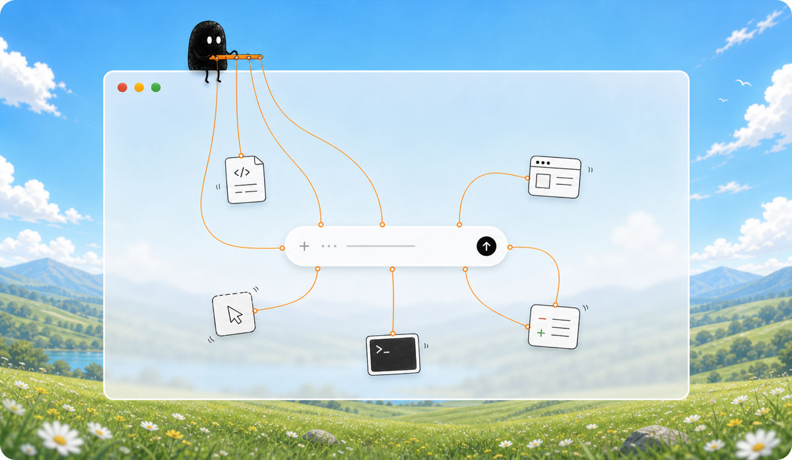

**Start**, your coding assistant.

```text
.
├── packages/
│   ├── desktop/
│   ├── ios/
│   ├── relay/
│   └── web/
├── patches/
└── scripts/
```

Use pnpm.

- install: `pnpm install`

- [desktop](https://github.com/sasicodes/start/tree/main/packages/desktop): `pnpm dev`
- [ios](https://github.com/sasicodes/start/tree/main/packages/ios): open in Xcode
- [relay](https://github.com/sasicodes/start/tree/main/packages/relay): `pnpm relay`
- [web](https://github.com/sasicodes/start/tree/main/packages/web): `pnpm web`

- check: `pnpm check`
- build: `pnpm build`
- package desktop: `pnpm package`
- desktop distributables: `pnpm dist`

Keep direct dependency versions pinned exactly. If `pnpm-lock.yaml` changes intentionally, commit with `ALLOW_LOCKFILE_CHANGE=1`.

Do not commit secrets, local paths, certificates, or personal email addresses.
